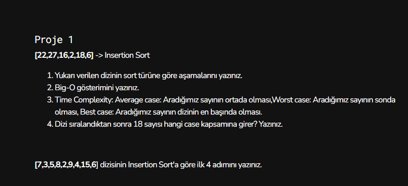
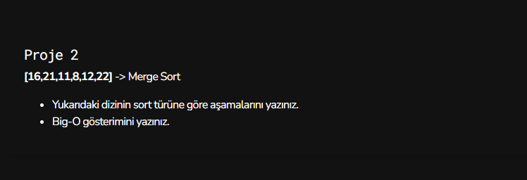
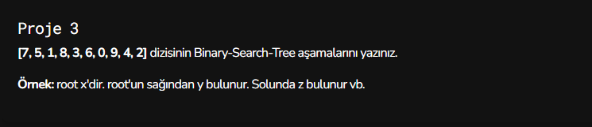
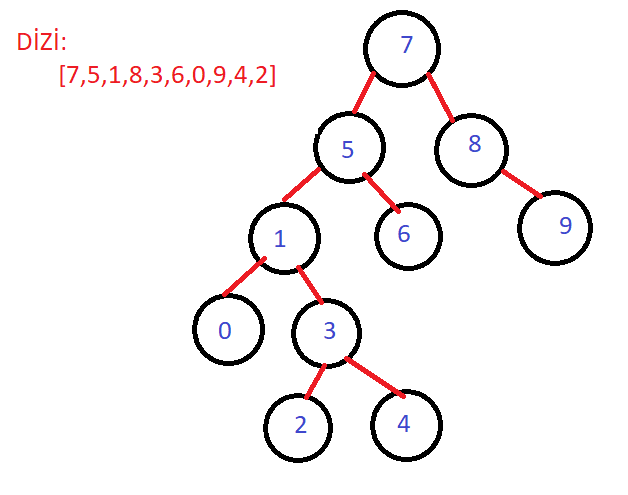

# Proje 1 - Insertion Sort Projesi

1. Yukarı verilen dizinin sort türüne göre aşamalarını yazınız.

 22' den başlarız. Sayımızın sağındaki ifadeyi sayımız ile karşılaştırırız.Küçük ise sayımızın ve kalan sayıların sol tarafına doğru geçiş yapar.
 Bu işaretin “|” solundaki sayılar sıralanmış kabul ediyoruz. Ve her geçişte bir sağındaki sayıyı alıyoruz.

 dizimiz : [22, 27, 16, 2, 18, 6] 

Cevap-1

   1. [22|, 27, 16, 2, 18, 6] 
   2. [22, 27|, 16, 2, 18, 6]
   3. [16, 22, 27|, 2, 18, 6] 
   4. [2, 16, 22, 27|, 18, 6] 
   5. [2, 16, 18, 22, 27|, 6] 
   6. [2, 6, 16, 18, 22, 27] 

2. Big-O gösterimini yazınız.
 
Cevap-2

  Best case    : O(n)
  Average case : O(n^2)
  Worst case   : O(n^2)

3. Time Complexity: 

Cevap-3

Sokma sıralamasının (insert sort) performansı O(n2)’dir. Insertion sort’un en kötü durumu tersten sıralı bir listedir. 

  Worst case: [27, 22, 18, 16, 6, 2]  
  Best case: [2, 6, 16, 18, 22, 27]

4. Dizi sıralandıktan sonra 18 sayısı hangi case kapsamına girer? Yazınız.

Cevap-4

 Average Case

* [7,3,5,8,2,9,4,15,6] dizisinin Insertion Sort'a göre ilk 4 adımını yazınız.

Cevap-5 

  1. [7| , 3, 5, 8, 2, 9, 4, 15, 6]
  2. [3, 7| , 5, 8, 2, 9, 4, 15, 6]
  3. [3, 5, 7| , 8, 2, 9, 4, 15, 6]
  4. [3, 5, 7, 8| , 2, 9, 4, 15, 6]

  # Proje 2 - Merge Sort Projesi

  

  1. Yukarı verilen dizinin sort türüne göre aşamalarını yazınız.

  Cevap-1 

    1. adım diziyi ikiye böl:
          16, 21, 11 ve 8, 12, 22
    2. adım çıkan bu dizileri de ikiye böl:
          16, 21; 11;  8, 12;  22;
    3. adım elde edilen parçalar 2 veya daha küçük eleman sayısına ulaştığı için dur (aksi durumda bölme işlemi devam edecekti)
    4. adım her parçayı kendi içinde sırala
          16, 21; 11; 8,12; 22;
    5. Her bölünmüş parçayı birleştir ve birleştirirken sıraya dikkat ederek birleştir (1. ve 2. parçalar ile 3. ve 4. parçalar aynı gruptan bölünmüştü)
          11, 16, 21 ve 8, 12, 22
    6. adım, tek bir bütün parça olmadığı için birleştirmeye devam et
          8, 11, 12, 16, 21, 22
    7. adım sonuçta bir bütün birleşmiş parça olduğu için dur. İşte bu sonuç dizisi ilk dizinin sıralanmış halidir.
          dizimiz : [8, 11, 12, 16, 21, 22] 

2. Big-O gösterimini yazınız.

Cevap-2 

  Best case    : O(n*logn)
  Average case : O(n*logn)
  Worst case   : O(n*logn)

 # Proje 3 - Binary Search Tree Projesi 
 

 Cevap

 

